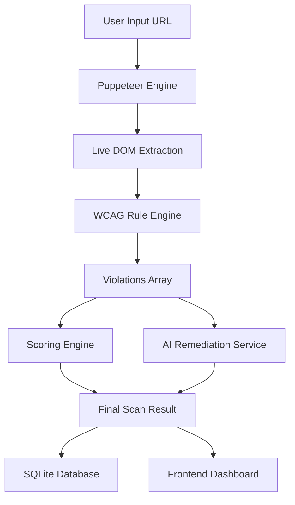

# AccessFix — Architectural Overview

AccessFix is designed with a research-grade, layered architecture to ensure modularity, scalability, and ease of expansion for accessibility rules and AI remediation strategies.

## 🏗 Layered Architecture

1.  **Presentation Layer (@accessfix/frontend)**
    -   Built with React and TypeScript.
    -   Uses a component-driven design system with TailwindCSS.
    -   State management via React Hooks and context where necessary.
    -   Data visualization provided by Recharts for accessibility trends.

2.  **API Layer (@accessfix/backend)**
    -   RESTful API built with Express.js and TypeScript.
    -   Orchestrates the scanning pipeline (Puppeteer → Cheerio → Rule Engine → AI Engine).
    -   Handles validation, error logging (Winston), and persistence.

3.  **Engine Layer (Core Logic)**
    -   **Puppeteer Engine**: Manages headless Chromium instances to render pages and capture live DOM/screenshots.
    -   **Rule Engine**: A registry-based system where each WCAG rule is a standalone module.
    -   **Scoring Engine**: Implements a weighted penalty algorithm based on violation severity (Critical, Major, Minor).
    -   **AI Engine**: An abstraction layer that communicates with LLM providers (OpenAI, Claude, local) to generate remediation suggestions.

4.  **Data Layer (Persistence)**
    -   Uses SQLite for lightweight, production-ready development storage.
    -   Follows a repository pattern (`ScanRepository`) for clean data access.

## 🔄 The Scanning Pipeline

## 🧠 AI Remediation Pipeline

The AI module uses a **Provider Factory Pattern**. This allows the platform to switch between different LLMs seamlessly via environment variables (`AI_PROVIDER`).
-   **Prompt Engineering**: Uses structured templates to provide context-rich snippets to the LLM.
-   **JSON Enforcement**: Ensures the AI returns parseable responses for automated fix application.
-   **Fallback Mechanics**: If the AI fails or is disabled, the platform falls back to rule-based static remediation suggestions.

## 🛡 Security & Compliance

-   **Environment Isolation**: Secrets and API keys are stored in `.env` and never exposed to the frontend.
-   **Input Sanitization**: All URLs and user inputs are validated before processing.
-   **DOM Sanitization**: Large HTML snippets are truncated/cleaned before being sent to AI providers to minimize costs and prevent prompt injection.
